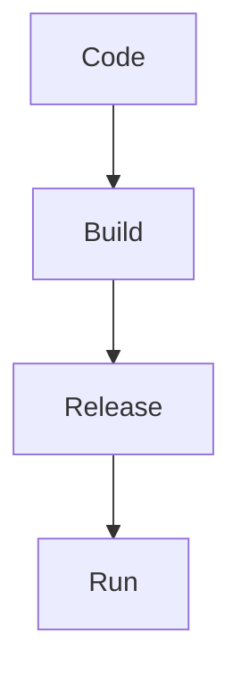

# Notetaking Skill

Create notes in a simple, human, and useful style.

## Main Goal

Write notes that are easy to read later, easy to revise, and clear enough to understand without unnecessary detail.

## Style

- Use Markdown format.
- Keep the tone natural and human.
- Be concise, but do not skip important meaning.
- Explain only where needed.
- Avoid copying large content from the internet.
- Prefer understanding over long definitions.
- Use simple examples when they make the topic clearer.
- Avoid over-formatting.

## Structure

Prefer this structure when it fits the topic:

```markdown
# Topic Name

## Summary

Short explanation of the topic.

## Core Idea

The main concept in simple words.

## Key Points

- Important point
- Important point
- Important point

## Example

Simple example if needed.

## Quick Revision

- Short recall point
- Short recall point
```

Adjust the structure if the topic needs a different format.

## Code Blocks

Use code blocks only when useful, such as:

- commands
- configuration files
- scripts
- syntax examples
- terminal output

Do not add code blocks everywhere.

## Diagrams

Use diagrams only when they genuinely help understanding.

Prefer Mermaid diagrams for Markdown-compatible diagrams.

Example:



Do not add diagrams unless they improve the note.

## Images

Use images only when:

- the user explicitly asks for them
- an image is clearly useful for understanding
- the note references an existing image path or URL

Do not add random image placeholders.

## Output Rules

- Write clean Markdown.
- Use headings clearly.
- Keep paragraphs short.
- Use bullet points for quick reading.
- Add examples only when helpful.
- Do not make the notes unnecessarily long.
- End with a small `Quick Revision` section when appropriate.
